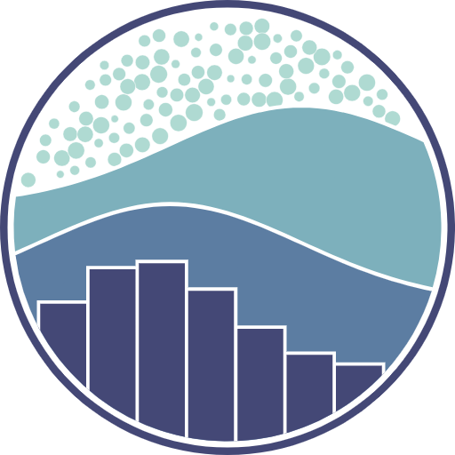

# <samp>&gt; Hi there, I'm <a href="https://gkassym.netlify.app" target="_blank">Praveen Kumar Singh</a>  </samp>

**`Welcome to my Data Analyst Portfolio!`**

  

I've learned POWER BI, Excel, SQL, and Python, but I haven't landed a job yet. I specialize in creating clear dashboards and reports using POWER BI, Python, SQL, and Excel, as demonstrated in my portfolio.

Thank you, looking forward to hearing from you.

---

   

    

     
    
    

---

- 🔭 I’m currently working on [Data Analysis with Python Course - Numpy, Pandas, Data Visualization](https://youtu.be/GPVsHOlRBBI?si=DKs2pLhDCNPuucPa)

- 🌱 I’m currently learning **SQL & Python Library**

- 👨‍💻 All of my projects are available at [https://praveensinghaws.github.io](https://praveensinghaws.github.io)

- 📫 How to reach me **praveenanalyst@hotmail.com**

### 🧰 Data Analytics Skills & Tools

 <a href="https://pandas.pydata.org/" target="_blank" rel="noreferrer"> 

  <!-- Clear the left alignment of the images -->

### 📊 Portfolio Highlights

- Proficient in creating insightful dashboards and reports using **POWER BI** and **Excel**.
- Strong command of database management and querying using **SQL**.
- Applied programming skills in **Python** for data analysis projects.
- Demonstrated ability to extract valuable insights from complex datasets.

### 💡 Strengths

- Analytical mindset and critical thinking.
- Problem-solving skills in data-driven scenarios.

I look forward to discussing how my data analytics skills align with your needs.

Thank you for your time, I look forward to hearing from you soon.

### 🔝 Top Contributed Repo
| Github Stats | Top Languages |
| --- | --- |
|  |  |
|  | 

